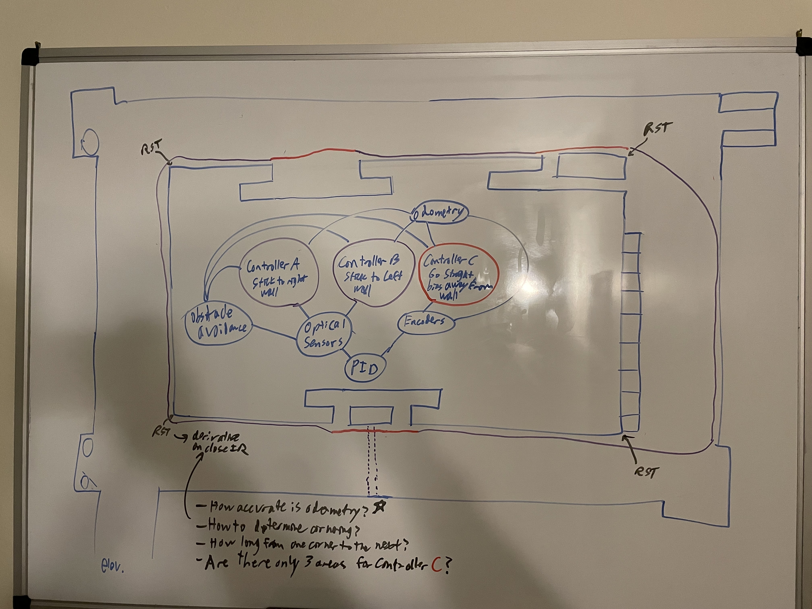

# ECE-1188_Hulk-Final-Race
Final Project for ECE 1188: Cyber-Physical Systems - an autonomous robot race around the 12th floor of Benedum Hall with dynamic obstacle avoidance.

`.gitignore` structure - Prepended "_" to file/directory name to not have it ignored.

Controllers are based on fusion of encoder-based odometry and optical sensors.
- Controller A/B - Wall Following controller to stick to left/right wall. 
  - Used when there are not funky wall changes (purple).
  - Uses a PID Controller 
    - Input = **Optical Sensors**
    - Output = Wheel RPMs
- Controller C - Go straight. Bias steering slightly away from whichever wall was just being followed to offset encoder error. 
  - Used when there are funky wall changes (red,) so we will go straight until the wall changes end. 
  - Uses a PID Controller
    - Input = **Wheel Encoders**
    - Output = Wheel RPMs
    
Questions: 
- [ ] How accurate is the odometry?
  - [ ] How long from one corner to the next (actually) on the 12th floor?
- [ ] How do we determine corners?
  - Can we take a time derivative of the optical sensor to determine a sharp change in distance?
  - Can we rely on odometry?
- [ ] Are there only 3 areas where we'd have to use controller C? Or are there more? 

    
